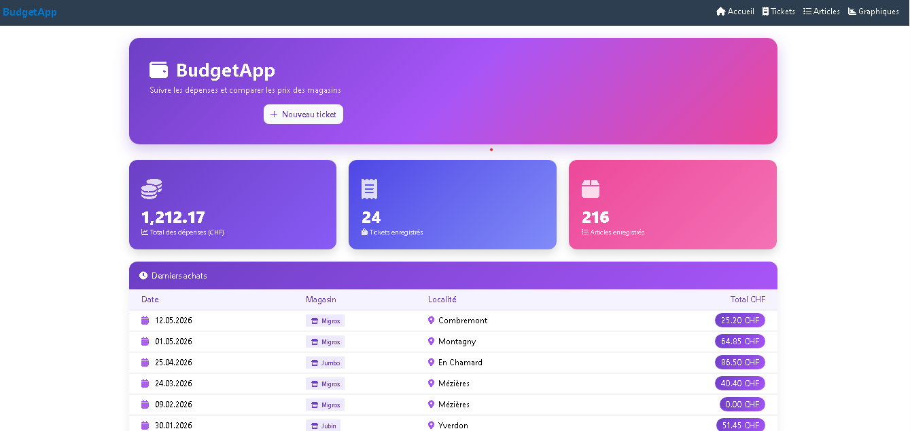
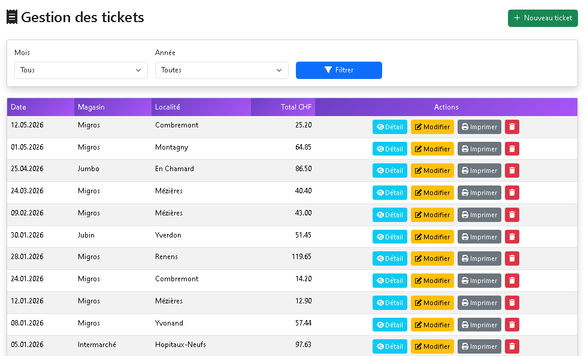
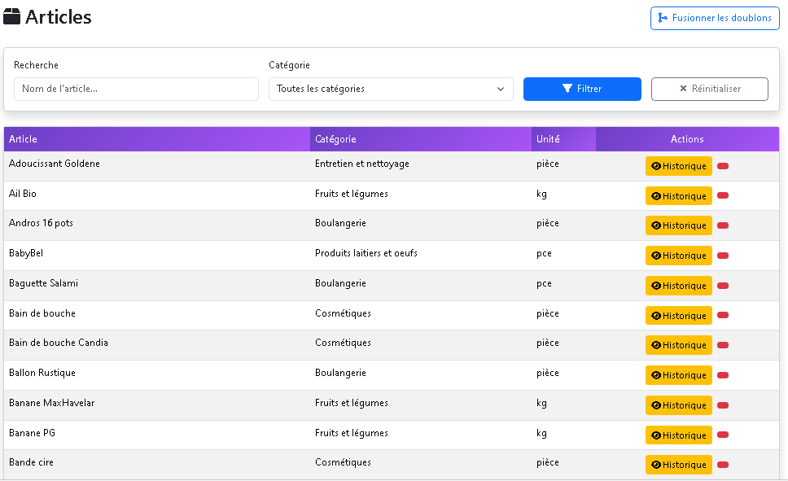
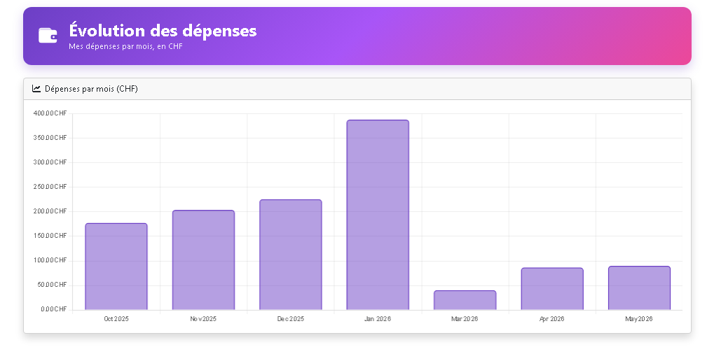

# Budget App
> Application web de gestion de budget et de comparaison des prix entre magasins.

BudgetApp permet de saisir ses tickets de caisse, de suivre ses dépenses mois par mois et de comparer le prix d'un même article d'un magasin à un autre.
L'application est conçue pour un usage personnel, sans publicité.

Projet réalisé dans le cadre d'un **TPI (Travail Pratique Individuel) – certification IDEC 2026**.

---

## Ce que fait l'application

- Saisir ses tickets de caisse (date, magasin, articles achetés)
- Suivre ses dépenses mois par mois
- Comparer le prix d'un même article entre magasins, avec son historique (prix min, max, moyen)
- Visualiser l'évolution des dépenses sous forme de graphique

## Aperçu

### Page d'accueil


### Gestion des tickets


### Historique des prix d'un article


### Évolution des dépenses



## Comment la lancer


Il faut **SQL Server Express** et **.NET 10** installés.

1. Cloner le dépôt.
2. Créer la base `Facture2026` et l'alimenter avec les scripts SQL du dossier `Scripts/`.
3. Dans Visual Studio : clic droit sur le projet → **Gérer les secrets utilisateur**, puis y mettre sa propre chaîne de connexion :
```json
{
  "ConnectionStrings": {
    "BudgetApp": "Server=.\\SQLEXPRESS;Database=NOMDELABASE;Trusted_Connection=True;TrustServerCertificate=True;"
  }
}
```
4. Appuyer sur **F5**.

## Stack

ASP.NET Core MVC (.NET 10) · C# · Entity Framework Core · SQL Server Express · Bootstrap 5 · Chart.js

---

**Mélanie Bovay** — TPI / IDEC 2026


