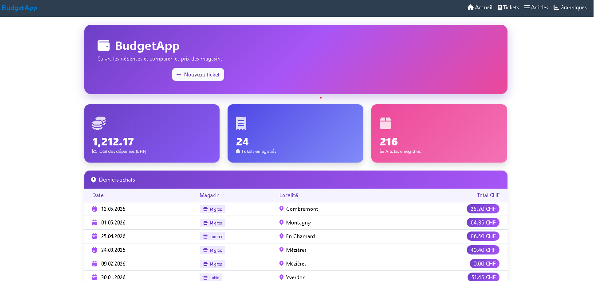
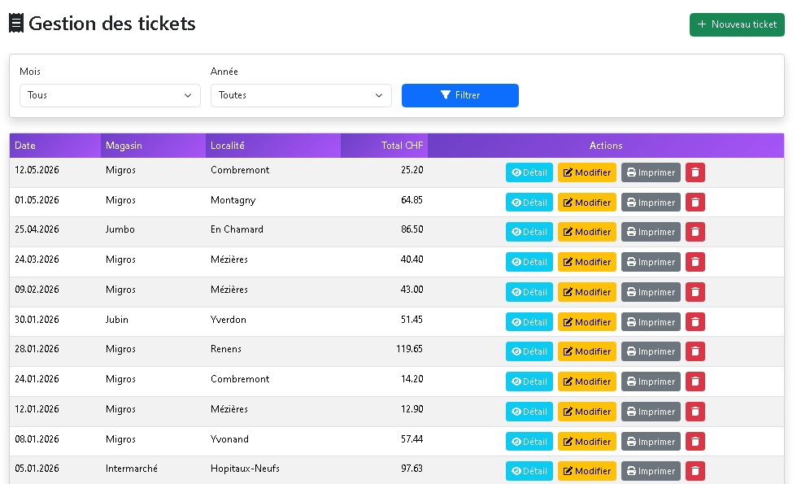
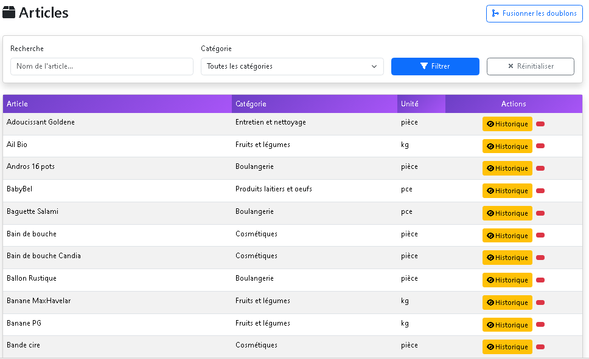
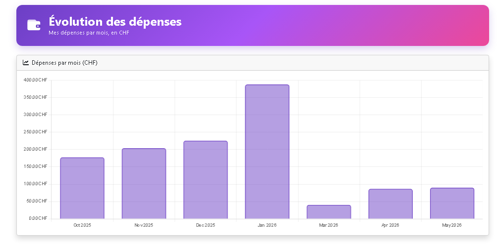

# Budget App
> Application web de gestion de budget et de comparaison des prix entre magasins.

BudgetApp permet de saisir ses tickets de caisse, de suivre ses dépenses mois par mois et de comparer le prix d'un même article d'un magasin à un autre.
L'application est conçue pour un usage personnel, sans publicité.

Projet réalisé dans le cadre d'un **TPI (Travail Pratique Individuel) – certification IDEC 2026**.

---

## Ce que fait l'application

- Saisir ses tickets de caisse (date, magasin, articles achetés)
- Suivre ses dépenses mois par mois
- Comparer le prix d'un même article entre magasins, avec son historique (prix min, max, moyen)
- Visualiser l'évolution des dépenses sous forme de graphique

## Aperçu

### Page d'accueil


### Gestion des tickets


### Historique des prix d'un article


### Évolution des dépenses


## Structure du dépôt

| Dossier | Contenu |
|---|---|
| `BudgetApp/` | Back-end ASP.NET Core MVC et API REST |
| `budget-app-front/` | Front-end Angular 20 (en cours de développement) |
| `docs/` | Captures d'écran |

## Comment la lancer (3 étapes)

### Avec Docker (recommandé)

Seul **Docker Desktop** est nécessaire (Pas de .NET ni de SQL Server à installer)

1. Cloner le dépôt :
```bash
git clone https://github.com/melanieyorbovay/BudgetApp.git
cd BudgetApp
```
2. Lancer dans le terminal :
```bash
docker compose up --build
```
3. Puis ouvrir **http://localhost:8080**

Le premier lancement prend quelques minutes pour le téléchargement des images. La base est créée automatiquement et alimentée avec des données de démonstration.

Pour arrêter : `Ctrl+C` puis `docker compose down`. Les données sont conservées dans un volume Docker ; `docker compose down -v` les supprime.

### Front-end Angular (en cours)

```bash
cd budget-app-front
npm install
ng serve
```
Puis **http://localhost:4200**. L'API doit tourner en parallèle sur le port 8080.


> Pour développer sans Docker : SQL Server Express, .NET 10, et la chaîne de connexion dans les secrets utilisateur (clé `ConnectionStrings:BudgetApp`).

> Le mot de passe de la base dans `docker-compose.yml` est volontairement en clair : il ne concerne qu'un conteneur de développement jetable pour démonstration


## Stack

ASP.NET Core MVC (.NET 10) · C# · Entity Framework Core · SQL Server · Angular 20 · TypeScript · Bootstrap 5 · Chart.js · Docker

---

**Mélanie Bovay** — TPI / IDEC 2026


