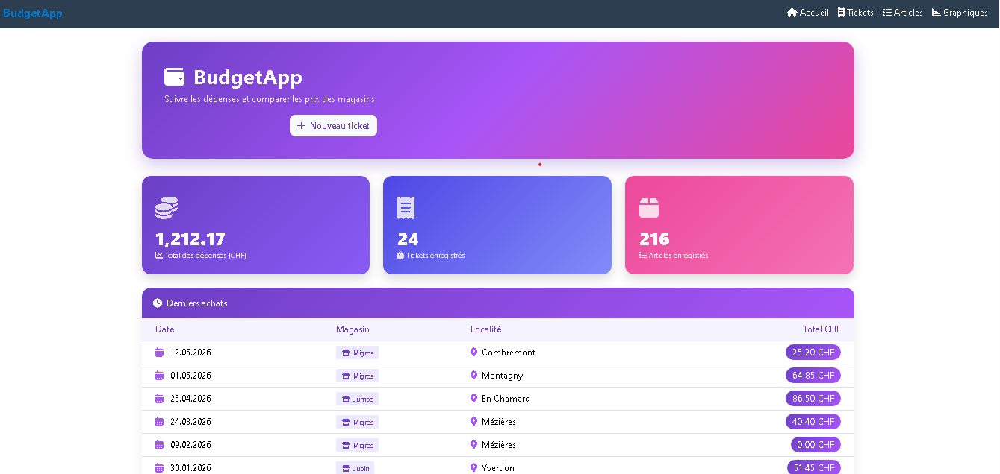
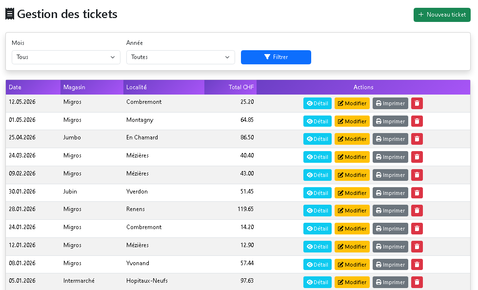
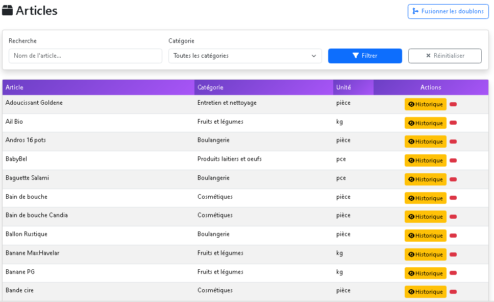
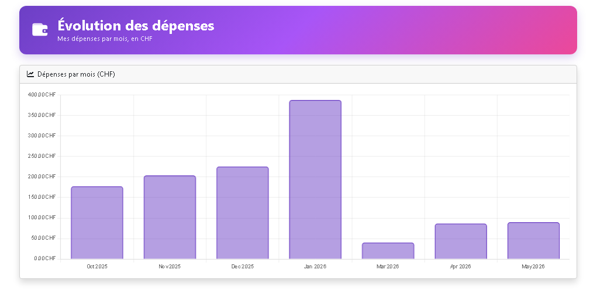

# Budget App
> Application web de gestion de budget et de comparaison des prix entre magasins.

BudgetApp permet de saisir ses tickets de caisse, de suivre ses dépenses mois par mois et de comparer le prix d'un même article d'un magasin à un autre.
L'application est conçue pour un usage personnel, sans publicité.

Projet réalisé dans le cadre d'un **TPI (Travail Pratique Individuel) – certification IDEC 2026**.

---

## Ce que fait l'application

- Saisir ses tickets de caisse (date, magasin, articles achetés)
- Suivre ses dépenses mois par mois
- Comparer le prix d'un même article entre magasins, avec son historique (prix min, max, moyen)
- Visualiser l'évolution des dépenses sous forme de graphique
- Gérer le catalogue d'article depuis le front Angular : recherche, filtre par catégorie, ajout (avec refus des doublons) et modification

## Aperçu

### Page d'accueil


### Gestion des tickets


### Historique des prix d'un article


### Évolution des dépenses


## Structure du dépôt

| Dossier | Contenu |
|---|---|
| `BudgetApp/` | Back-end ASP.NET Core MVC et API REST |
| `budget-app-front/` | Front-end Angular 20 (en cours de développement) |
| `docs/` | Captures d'écran |

## Comment la lancer 

L'application se compose de deux parties : l'**API** (avec sa base SQL Serveur) et le **front Angular**. L'URL de l'API utilisée par le front est définie dans `budget-app-front/src/environments/`.

### Option 1: API avec Docker (recommandé)

Seul **Docker Desktop** est nécessaire (Pas de .NET ni de SQL Server à installer)

Sur Mac Apple Silicon, activer Rosetta dans Docker Desktop (Settings -> General -> "Use Rosetta for x86/amd64 emulation") : 
l'image SQL Server n'existe qu'en amd64, d'où le `platform: linux/amd64` déclaré dans docker-compose.yml.

1. Cloner le dépôt :
```bash
git clone https://github.com/melanieyorbovay/BudgetApp.git
cd BudgetApp
```
2. Lancer dans le terminal :
```bash
docker compose up --build
```
3. L'API est alors disponible sur **http://localhost:8080** (par exemple `http://localhost:8080/api/articles`). Pour afficher l'application, lancer le front (voir plus bas).

Le premier lancement prend quelques minutes pour le téléchargement des images. La base est créée automatiquement et alimentée avec des données de démonstration.

Pour arrêter : `Ctrl+C` puis `docker compose down`. Les données sont conservées dans un volume Docker ; `docker compose down -v` les supprime.

### Option 2 : API sans Docker (développement)

Prérequis: SQL Server Express, .NET 10, et la chaîne de connexion dans les secrets utilisateur (clé `ConnectioString: BudgetApp`).
Lancer le projet depuis Visual Studio avec le profil **https** : l'API écoute alors sur **https://localhost:7166**.
Si le navigateur refuse la connexion, approuver le certificat de développement : `dotnet dev-certs https --trust`.

###Front-end Angular

```bash
cd budget-app-front
npm install
```
Puis, selon l'API utilisée :

| API utilisée | Commande | URL appelée par le front |
|---|---|---|
| Visual Studio | `ng serve`| `https://localhost:7166/api` |
| Docker | `ng serve --configuration production` | `http://localhost:8080/api` |

Ouvrir ensuite **http://localhost4200**. En mode production, la première compilation peut prendre quelques minutes.

> Le mot de passe de la base dans `docker-compose.yml` est volontairement en clair : il ne concerne qu'un conteneur de développement jetable pour démonstration


## Stack

ASP.NET Core MVC (.NET 10) · C# · Entity Framework Core · SQL Server · Angular 20 · TypeScript · Bootstrap 5 · Chart.js · Docker

---

**Mélanie Bovay** — TPI / IDEC 2026


